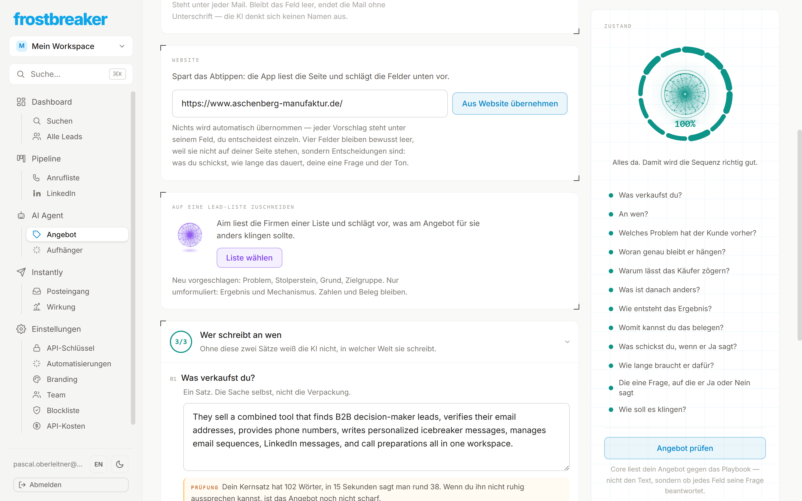
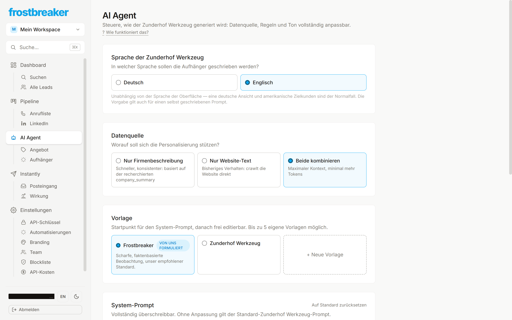
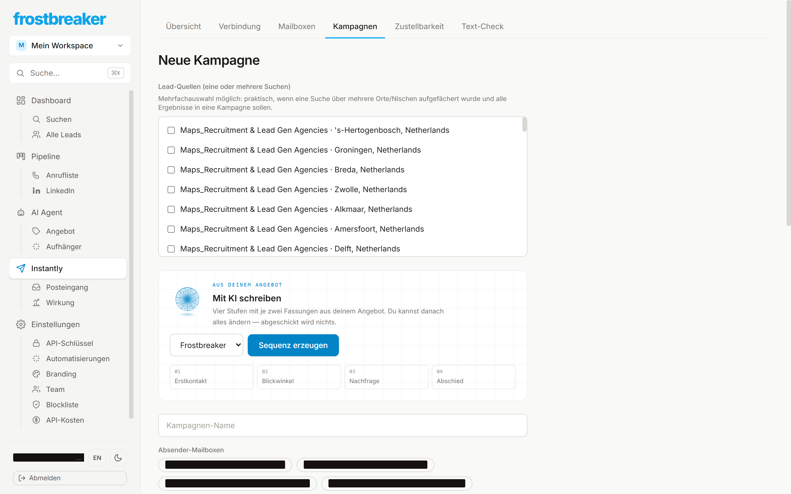
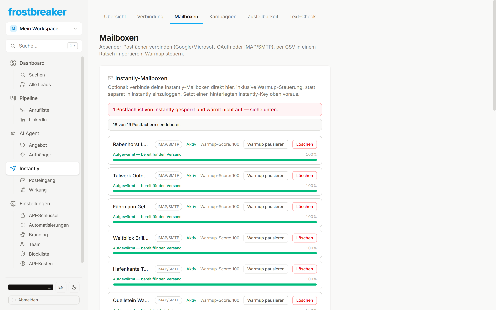
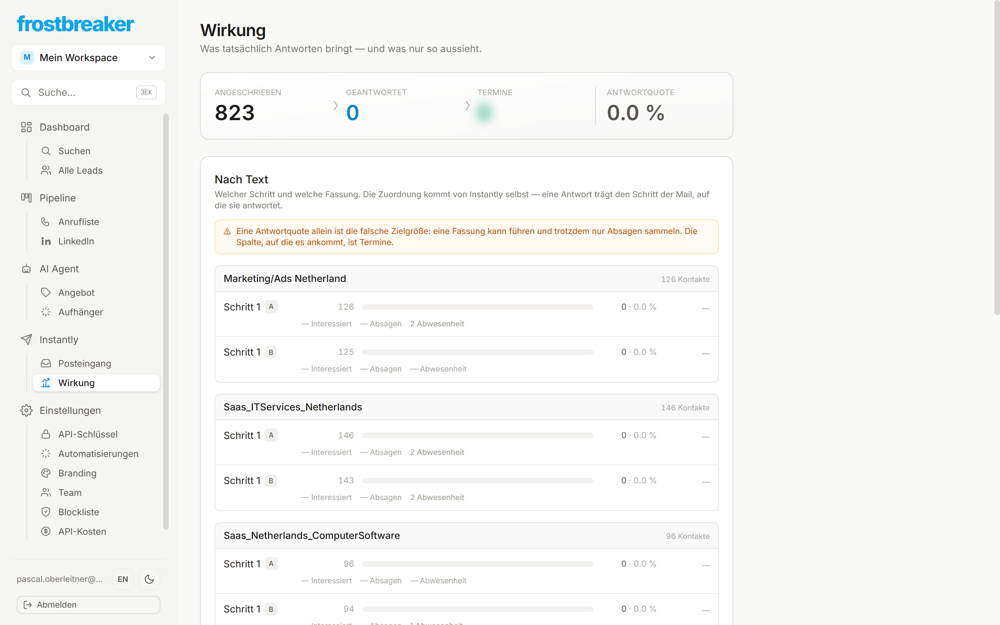
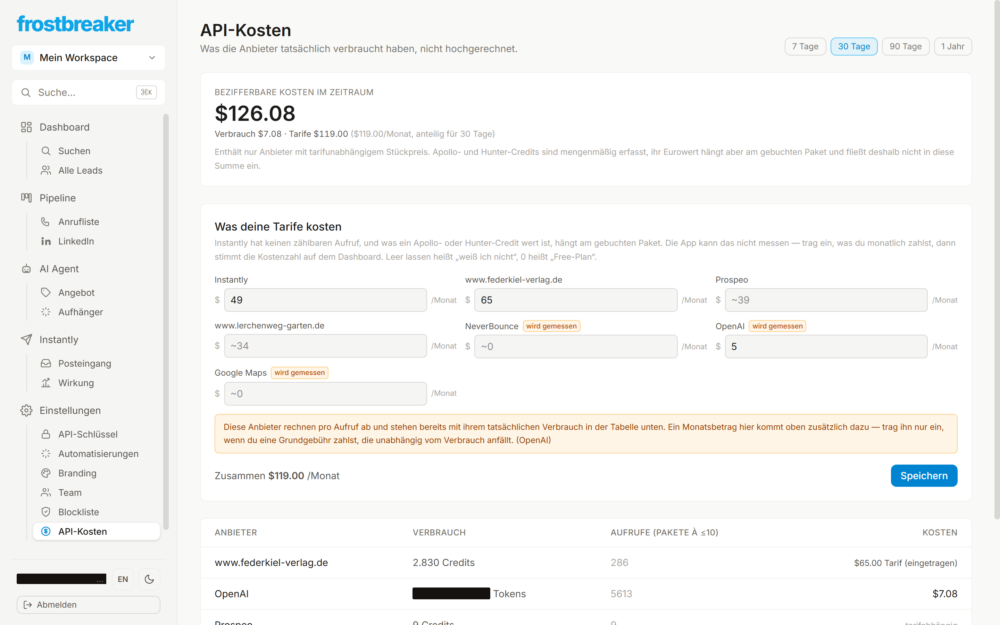

# Frostbreaker

**Frostbreaker findet Entscheider in Firmen, die zu meinem Angebot passen,
schreibt jedem eine eigene E-Mail und verfolgt, wer geantwortet hat.** Was
sonst mehrere Leute erledigen — recherchieren, texten, versenden, nachfassen,
auswerten — läuft hier in einem Werkzeug.

Ich habe es gebaut, weil ich Kaltakquise selbst betreibe und die vorhandenen
Werkzeuge jeweils nur ein Stück davon abdecken: Lead-Datenbanken kennen die
Firmen, aber nicht meinen Text. Sendetools kennen den Versand, aber nicht die
Antwort. Erst wenn beides in derselben Datenbank liegt, lässt sich sagen,
**welche Formulierung Termine gebracht hat.**


---

## Was drinsteckt — und warum

Jede Funktion unten ist eine Entscheidung über Kaltakquise. Der eingerückte
Satz ist jeweils der wichtigere.

### 1 · Zielgruppe: Entscheider statt Sammeladressen

Suchen nach Nische, Ort, Größe — oder nach der **eingesetzten Technik** und
nach **offenen Stellen**. Vier Quellen, je nachdem was gesucht wird.

> Wer gerade jemanden für ein Problem sucht, hat es *jetzt* und nicht
> irgendwann. Das trifft besser als jede Branchenliste. Und Adressen wie
> `info@` fallen automatisch raus: an eine Adresse, für die niemand zuständig
> ist, schreibt man nicht kalt an.


### 2 · Aus der Suche wird eine Liste mit Namen

Name, Rolle, geprüfte E-Mail-Adresse, Telefon und LinkedIn — soweit
öffentlich. Adressen werden vor dem Versand verifiziert.

> Jede unzustellbare Mail zählt auf die Bounce-Rate, und die entscheidet, ob
> die nächsten überhaupt ankommen. Prüfen ist billiger als zurückbekommen.


### 3 · Core — das Angebot aus der eigenen Website

Zwölf Fragen stehen zwischen mir und einer fertigen Sequenz: was verkaufe ich,
an wen, welches Problem hat der Empfänger vorher, was ist danach anders, womit
belege ich das, worum bitte ich. **Core** liest meine Website und schlägt
sieben davon vor — einzeln zu bestätigen, nichts wird automatisch übernommen.
Danach liest Core das fertige Angebot noch einmal gegen das Playbook: nicht
den Text, sondern ob jedes Feld seine Frage überhaupt beantwortet.

> Die meisten Kaltmails scheitern nicht am Text, sondern am unklaren Angebot.
> Wer diese zwölf Fragen nicht beantworten kann, schreibt zwangsläufig
> Allgemeinplätze — egal wie gut formuliert.

Vier Felder bleiben bewusst leer, weil sie nicht auf der Website stehen,
sondern Entscheidungen sind: was ich schicke, wie lange es dauert, meine eine
Frage und der Ton.


### 4 · Aim — dasselbe Angebot, zugeschnitten auf eine Lead-Liste

**Das ist die Hälfte, die sonst niemand macht.** Mein Angebot ändert sich
nicht, wenn ich statt Recruiting-Agenturen jetzt SaaS-Anbieter anschreibe. Was
sich sehr wohl ändert: **woran diese Empfänger hängen und warum sie zögern.**

In meinem Workspace liegen vier Listen — *Marketing/Ads*, *SaaS/IT-Services*,
*SaaS/Computer-Software*, *Recruiting & Lead-Gen-Agenturen*, alle Niederlande.
Ein Problem-Satz, der auf alle vier passt, passt auf keine.

**Aim** liest deshalb genau eine Liste: die Filter der Suche und die
recherchierten Firmenbeschreibungen der Empfänger. Daraus schlägt es die
Felder vor, die sich von Liste zu Liste unterscheiden — **Problem,
Stolperstein, Grund, Zielgruppe.** Ergebnis und Mechanismus werden nur
umformuliert. **Zahlen und Beleg bleiben unangetastet.**

> Core schaut auf mich, Aim auf den Empfänger. Zwei Zielgruppen brauchen
> deshalb nicht zwei Angebote, sondern ein Angebot und zwei Zuschnitte.

Beide halten dieselbe Grenze ein: **was im Material nicht steht, bleibt leer.**
Kein Modell erfindet hier eine Referenz oder eine Zahl.



### 5 · Ein eigener Aufhänger je Firma

Die KI liest, was die einzelne Firma tut, und schreibt daraus den ersten Satz.
Quelle, Tonfall und verbotene Wörter sind einstellbar; getestet wird an einer
echten Firma, bevor etwas gespeichert wird.

> Ein eingesetzter Firmenname ist keine Personalisierung, sondern ein
> Serienbrief mit Platzhalter. Der Empfänger merkt den Unterschied in der
> ersten Zeile — und entscheidet dort, ob er weiterliest.



### 6 · Vier Stufen, nicht vier Erinnerungen

Aus dem Angebot entsteht die Sequenz: **Tag 0, 3, 5 und 7**, je zwei Fassungen
zum Vergleich, **ein Betreff über alle vier** — die Follow-ups gehören zum
selben Gespräch. Jede Stufe hat eine eigene Aufgabe: Beobachtung, anderer
Blickwinkel, kurze Nachfrage, Abschied. Alles änderbar; die Werte sind ein
Vorschlag aus dem Playbook, keine Vorschrift.

> Eine einzelne Mail ist ein Los. Und jede Stufe endet bei einer kleinen
> Frage, nicht bei einer Terminbitte: „Kostenloses Erstgespräch vereinbaren"
> steht auf fast jeder Website — am Ende einer Kaltmail ist das die größte
> Bitte, die es gibt.



### 7 · Elf Prüfungen, bevor etwas rausgeht

Technik und Text: SPF, DKIM, Bounce-Quote, sendbare Adressen, dazu Länge,
Spam-Wörter und KI-Klang. Vier der elf können den Start aufhalten.

> Nicht als Gängelung. Eine verbrannte Absender-Domain kostet mehr als eine
> verschobene Kampagne — und man merkt es erst, wenn nichts mehr ankommt.


### 8 · Postfächer mit Aufwärmphase

Mehrere Absender-Postfächer, jedes mit eigenem Warmup-Stand und Tagesmenge.

> Zustellbarkeit ist kein Zufall, sondern Mengenplanung. Ein neues Postfach,
> das sofort hundert Mails am Tag schickt, landet im Spam — und nimmt die
> Domain mit.



### 9 · E-Mail, dann LinkedIn, dann Telefon — als eine Kette

Antwortet jemand nach der Sequenz nicht, erscheint eine **LinkedIn-Aufgabe**,
aber nur dort, wo ein Profil hinterlegt ist. Die Nachricht ist bereits
eingesetzt, mit demselben Aufhänger wie die Mail. Antwortet er auch darauf
nicht, kommt der **Anruf** — mit Nummer und Vorbereitung aus der Recherche.

Immer genau ein nächster Schritt, nie zwei gleichzeitig. **Wer antwortet,
bekommt im selben Moment nichts mehr** — über alle Kanäle hinweg, weil alle
vier Wege in eine Kampagne dieselbe Prüfung fragen.

> Ein gekaufter Lead kostet gleich viel, egal über wie viele Kanäle ich ihn
> anspreche. Das Meiste aus einem Kontakt zu holen ist billiger, als einen
> neuen zu kaufen — und drei Berührungspunkte über drei Kanäle erreichen
> jemanden zuverlässiger als drei Mails.

Die Kette geht auch andersherum: während ein neues Postfach zwei bis vier
Wochen aufwärmt, lässt sich schon auf LinkedIn schreiben — und die Mail geht
später nur an die, die dort nicht geantwortet haben.

### 10 · Jede Antwort landet im CRM, nicht im Postfach

Eingehende Antworten werden **automatisch eingestuft** — interessiert,
Rückfrage, Absage, Abwesenheitsnotiz — und dem Kontakt zugeordnet. Daraus
wird eine Stufe in der Pipeline, ein Deal mit Wert und Wahrscheinlichkeit,
eine Aufgabe mit Fälligkeit. Der Anruf von gestern und die Mail von vor drei
Wochen stehen in derselben Historie.

> Abwesenheitsnotizen laufen getrennt und zählen nicht als Antwort. Sonst
> sieht jede Urlaubszeit aus wie eine gute Woche.

### 11 · Gemessen wird an Terminen, nicht an Antworten

Je Stufe und je Textfassung: Antworten, Absagen, Termine. Dazu Wochentag und
Uhrzeit. Unter 30 Kontakten je Fassung bleibt das Prozentfeld leer.

> Die Antwortquote ist die falsche Zielgröße — eine Fassung kann führen und
> nur Absagen sammeln. Und eine Quote aus zwölf Mails ist ein Münzwurf mit
> Nachkommastelle.



### 12 · Was es kostet, steht daneben

Jeder bezahlte Abruf wird mit Menge und Betrag erfasst — Lead-Daten,
Adressprüfung, KI-Texte.

> Erst wenn der Preis pro Lead dasteht, ist Kaltakquise eine Rechnung statt
> eines Bauchgefühls. Ist ein Preis unbekannt, bleibt das Feld leer statt
> geschätzt.



---

## Alles Weitere, kurz

| | |
|---|---|
| **Lead-Abo** | Eine gespeicherte Suche wächst wöchentlich von allein weiter. |
| **CSV-Import** | Eigene Listen mitbringen; Spalten werden automatisch zugeordnet. |
| **Sperrliste** | Bestandskunden und Absager je Workspace, nie wieder angeschrieben. |
| **Abmelde-Link** | Eigene Route ohne Login, wie es das Gesetz verlangt. |
| **Dublettenschutz** | Dieselbe Firma wird nicht zweimal eingekauft — gemessen 11 % gespart. |
| **Mehrere Workspaces** | Ein Konto, getrennte Kunden: eigene Leads, Sperrliste, Branding, Bericht. |
| **Team-Zugänge** | Eigener Login je Person, Rolle Admin oder Mitglied. |
| **Bericht je Kunde** | Ein Link im Look des Kunden, ohne Account, ohne Kontaktdaten. |
| **Antwortassistent** | Drei Entwurfsantworten auf Klick, nicht automatisch. |
| **Copy-Check** | Lesbarkeit, Spam-Risiko, KI-Klang — beim Tippen, ohne zweites Tool. |
| **Zustellbarkeits-Wache** | Bounce-Quote und Domain-Einstellungen laufend geprüft. |
| **Eigene API-Schlüssel** | Jeder Nutzer hinterlegt seine eigenen Zugänge, verschlüsselt gespeichert. |
| **Zwei Sprachen** | Oberfläche und erzeugte Mails getrennt einstellbar. |

---

## Womit ich es selbst betreibe

Zahlen aus dem laufenden Betrieb, Stand 17.08.2026:

| | |
|---|---|
| Firmen in der Datenbank | 3.081 |
| Kontakte, davon mit geprüfter Adresse | 3.007 / 1.650 |
| Personalisierte Aufhänger | 2.161 |
| Versendete Mails | 840 |
| Bounce-Rate | 0,2 % |
| Absender-Postfächer | 19 |
| Abfragekosten gesamt | 62,62 $ |

Die Zeitrechnung im Dashboard (rund 364 Stunden Recherche in 14 Tagen) ist
eine Hochrechnung mit offengelegter Formel, keine Messung — sie steht dort
mit ihrer Rechnung daneben.

---

## Wie es gebaut ist

Für alle, die es interessiert — es ist nicht der Punkt dieser Seite.

| Teil | Was | Wo |
|---|---|---|
| `apps/web` | Next.js 15, React 19, Tailwind v4 — Oberfläche und alle API-Routen | Vercel |
| `apps/worker` | Python-Daemon, führt die Lead-Pipelines aus | Railway |
| `supabase/` | Postgres: Schema, Warteschlange, Zugriffsregeln | Supabase |

Versendet wird über **Instantly**; eine eigene Sende-Engine gibt es bewusst
nicht. Lead-Quellen sind Google Maps, Hunter, Apollo und Prospeo.

96 Migrationen · 41 API-Routen · 34 Bildschirme · 823 Frontend-Tests · 201
Worker-Tests · rund 60.000 Zeilen.

```bash
cd apps/web && npm install && npm run dev
cd apps/worker && pip install -e ".[dev]" && python -m pytest
```

`docs/BETRIEB.md` beschreibt, was tatsächlich wo läuft.

---

## Zu den Bildern

Echte Bildschirme aus dem laufenden Betrieb. Alle Namen, Firmen, Domains und
Adressen darin sind ersetzt — auf keinem Bild steht ein echter Kontakt. Die
Lead-Einträge und die Zahl der gebuchten Termine sind zusätzlich unscharf:
sichtbar bleibt, *was* dort steht, nicht *wer*.
