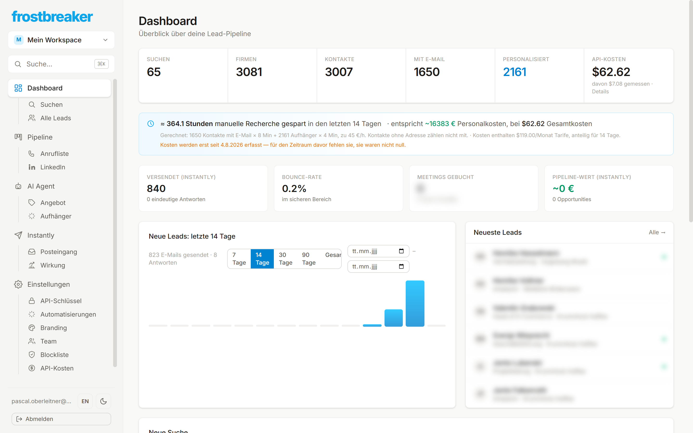
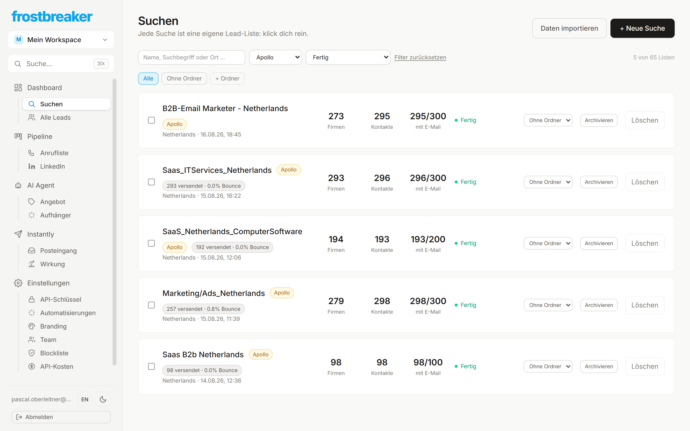
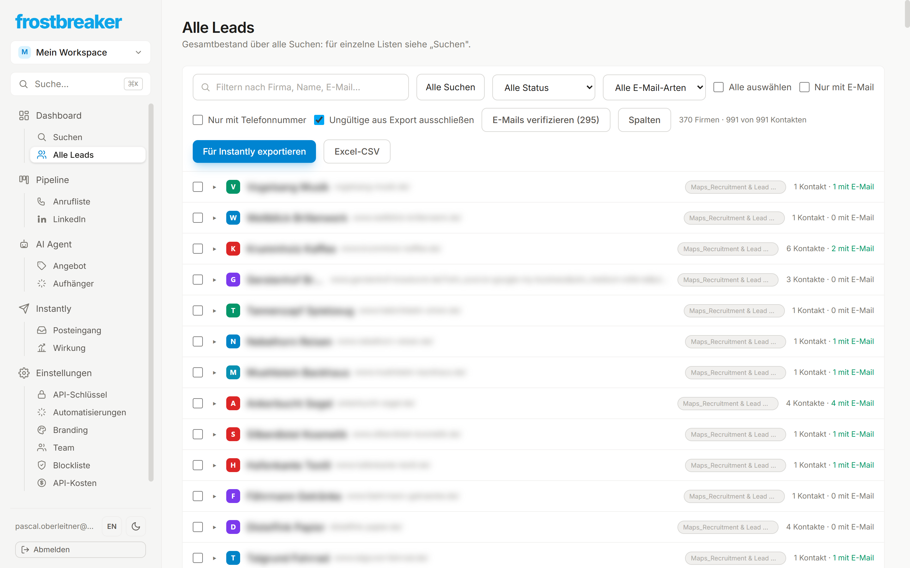
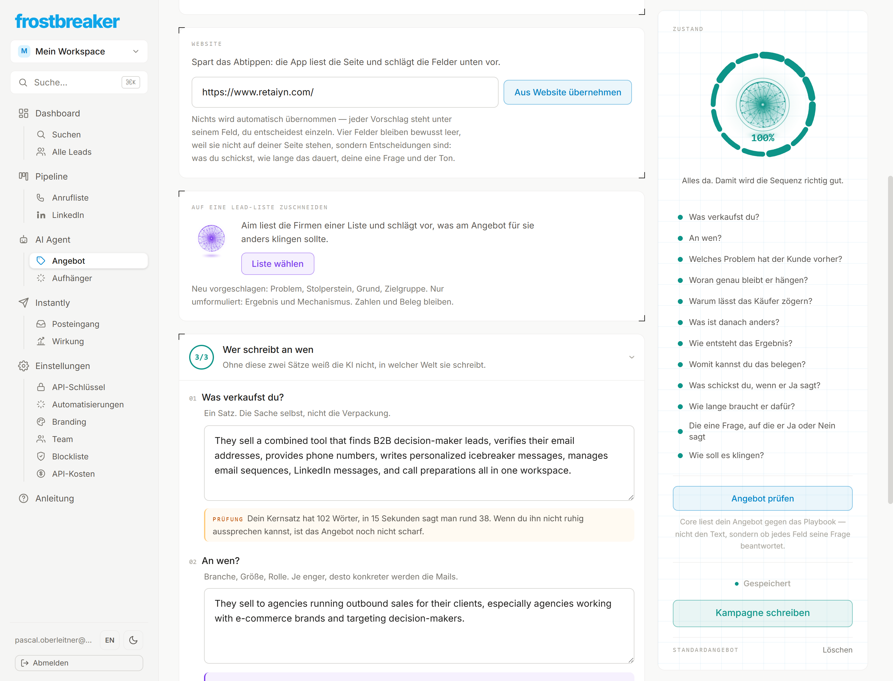
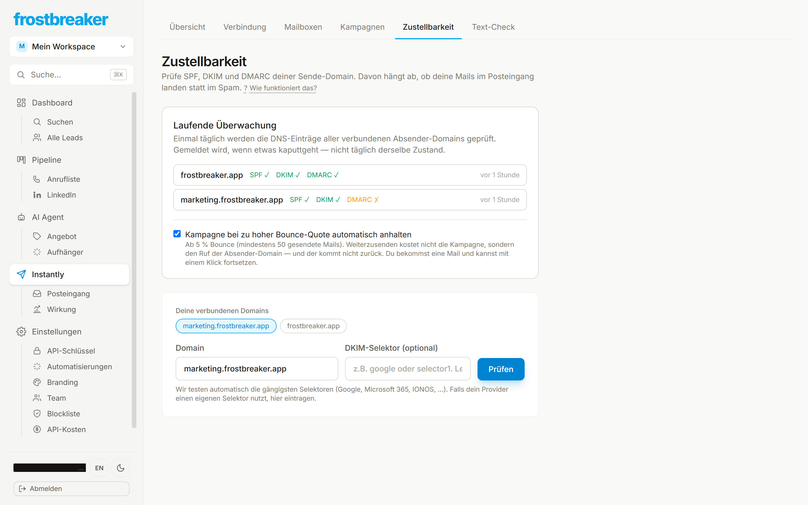

# Frostbreaker

**Frostbreaker findet Entscheider in Firmen, die zu meinem Angebot passen,
schreibt jedem eine eigene E-Mail und verfolgt, wer geantwortet hat.** Was
sonst mehrere Leute erledigen — recherchieren, texten, versenden, nachfassen,
auswerten — läuft hier in einem Werkzeug.

Ich habe es gebaut, weil ich Kaltakquise selbst betreibe und die vorhandenen
Werkzeuge jeweils nur ein Stück davon abdecken: Lead-Datenbanken kennen die
Firmen, aber nicht meinen Text. Sendetools kennen den Versand, aber nicht die
Antwort. Erst wenn beides in derselben Datenbank liegt, lässt sich sagen,
**welche Formulierung Termine gebracht hat.**



---

## Was drinsteckt — und warum

Jede Funktion unten ist eine Entscheidung über Kaltakquise. Der zweite Satz
ist jeweils der wichtigere.

### 1 · Zielgruppe: Entscheider statt Sammeladressen

Suchen nach Nische, Ort, Größe — oder nach der **eingesetzten Technik** und
nach **offenen Stellen**.

> Wer gerade jemanden für ein Problem sucht, hat es *jetzt* und nicht
> irgendwann. Das trifft besser als jede Branchenliste. Und Adressen wie
> `info@` fallen automatisch raus: an eine Adresse, für die niemand zuständig
> ist, schreibt man nicht kalt an.



### 2 · Aus der Suche wird eine Liste mit Namen

Name, Rolle, geprüfte E-Mail-Adresse, Telefon und LinkedIn — soweit
öffentlich. Adressen werden vor dem Versand verifiziert.

> Jede unzustellbare Mail zählt auf die Bounce-Rate, und die entscheidet, ob
> die nächsten Mails überhaupt ankommen. Prüfen ist billiger als zurückbekommen.



### 3 · Das Angebot als Grundlage, nicht der Text

Zwölf Fragen: was verkaufst du, an wen, welches Problem hat der Empfänger
vorher, was ist danach anders, womit belegst du das, worum bittest du. Sieben
Antworten liest die App aus der eigenen Website vor.

> Die meisten Kaltmails scheitern nicht am Text, sondern am unklaren Angebot.
> Wer diese zwölf Fragen nicht beantworten kann, schreibt zwangsläufig
> Allgemeinplätze — egal wie gut formuliert.



### 4 · Ein eigener Aufhänger je Firma

Die KI liest, was die Firma tut, und schreibt daraus den ersten Satz. Quelle,
Tonfall und verbotene Wörter sind einstellbar; getestet wird an einer echten
Firma, bevor etwas gespeichert wird.

> Ein eingesetzter Firmenname ist keine Personalisierung, sondern ein
> Serienbrief mit Platzhalter. Der Empfänger merkt den Unterschied in der
> ersten Zeile — und entscheidet dort, ob er weiterliest.


### 5 · Sequenz statt Einzelmail

Aus dem Angebot entstehen mehrere Stufen mit je zwei Fassungen zum Vergleich:
Erstkontakt, anderer Blickwinkel, kurze Nachfrage, Abschied. Alles änderbar.

> Eine einzelne Mail ist ein Los. Und jede Stufe endet bei einer kleinen
> Frage, nicht bei einer Terminbitte: „Kostenloses Erstgespräch vereinbaren"
> steht auf fast jeder Website — am Ende einer Kaltmail ist das die größte
> Bitte, die es gibt.


### 6 · Elf Prüfungen, bevor etwas rausgeht

Technik und Text: SPF, DKIM, Bounce-Quote, sendbare Adressen, dazu Länge,
Spam-Wörter und KI-Klang. Vier der elf können den Start aufhalten.

> Nicht als Gängelung. Eine verbrannte Absender-Domain kostet mehr als eine
> verschobene Kampagne — und man merkt es erst, wenn nichts mehr ankommt.



### 7 · Postfächer mit Aufwärmphase

Mehrere Absender-Postfächer, jedes mit eigenem Warmup-Stand und Tagesmenge.

> Zustellbarkeit ist kein Zufall, sondern Mengenplanung. Ein neues Postfach,
> das sofort hundert Mails am Tag schickt, landet im Spam — und nimmt die
> Domain mit.


### 8 · Drei Kanäle als eine Kette

Antwortet jemand nicht auf die Mails, steht die LinkedIn-Nachricht bereit.
Antwortet er darauf nicht, kommt der Anruf — mit Nummer und Vorbereitung. Wer
antwortet, bekommt im selben Moment nichts mehr.

> Ein gekaufter Lead kostet gleich viel, egal über wie viele Kanäle man ihn
> anspricht. Das Meiste aus einem Kontakt zu holen ist billiger, als einen
> neuen zu kaufen.

### 9 · Gemessen wird an Terminen, nicht an Antworten

Je Stufe und je Textfassung: Antworten, Absagen, Termine. Unter 30 Kontakten
bleibt das Prozentfeld leer.

> Die Antwortquote ist das falsche Ziel — eine Fassung kann vorn liegen und
> nur Absagen sammeln. Und eine Quote aus zwölf Mails ist ein Münzwurf mit
> Nachkommastelle.


### 10 · Was es kostet, steht daneben

Jeder bezahlte Abruf wird mit Menge und Betrag erfasst — Lead-Daten,
Adressprüfung, KI-Texte.

> Erst wenn der Preis pro Lead dasteht, ist Kaltakquise eine Rechnung statt
> eines Bauchgefühls. Ist ein Preis unbekannt, bleibt das Feld leer statt
> geschätzt.


---

## Womit ich es selbst betreibe

Zahlen aus dem laufenden Betrieb, Stand 17.08.2026:

| | |
|---|---|
| Firmen in der Datenbank | 3.081 |
| Kontakte, davon mit geprüfter Adresse | 3.007 / 1.650 |
| Personalisierte Aufhänger | 2.161 |
| Versendete Mails | 840 |
| Bounce-Rate | 0,2 % |
| Absender-Postfächer | 19 |
| Abfragekosten gesamt | 62,62 $ |

Die Zeitrechnung im Dashboard (rund 364 Stunden Recherche in 14 Tagen) ist
eine Hochrechnung mit offengelegter Formel, keine Messung — sie steht dort
mit ihrer Rechnung daneben.

---

## Wie es gebaut ist

Für alle, die es interessiert — es ist nicht der Punkt dieser Seite.

| Teil | Was | Wo |
|---|---|---|
| `apps/web` | Next.js 15, React 19, Tailwind v4 — Oberfläche und alle API-Routen | Vercel |
| `apps/worker` | Python-Daemon, führt die Lead-Pipelines aus | Railway |
| `supabase/` | Postgres: Schema, Warteschlange, Zugriffsregeln | Supabase |

Versendet wird über **Instantly**; eine eigene Sende-Engine gibt es bewusst
nicht. Lead-Quellen sind Google Maps, Hunter, Apollo und Prospeo — jeder Nutzer
hinterlegt seine eigenen Zugänge, verschlüsselt gespeichert.

96 Migrationen · 41 API-Routen · 34 Bildschirme · 823 Frontend-Tests · 201
Worker-Tests · rund 60.000 Zeilen.

```bash
cd apps/web && npm install && npm run dev
cd apps/worker && pip install -e ".[dev]" && python -m pytest
```

`docs/BETRIEB.md` beschreibt, was tatsächlich wo läuft.

---

## Zu den Bildern

Echte Bildschirme aus dem laufenden Betrieb. Alle Namen, Firmen, Domains und
Adressen darin sind ersetzt — auf keinem Bild steht ein echter Kontakt. Die
Lead-Einträge und die Zahl der gebuchten Termine sind zusätzlich unscharf:
sichtbar bleibt, *was* dort steht, nicht *wer*.
